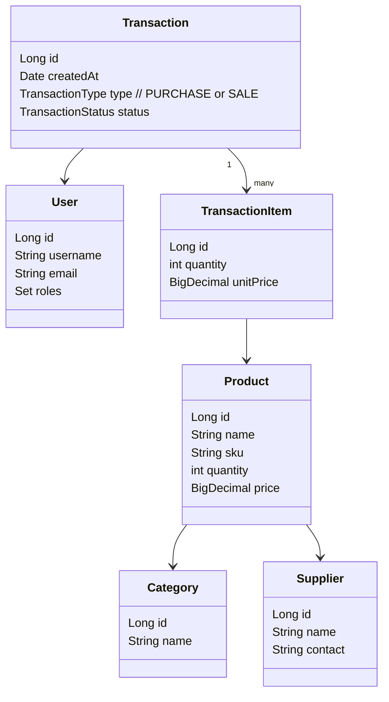

<h1 align="center">Smart Inventory Management System</h1>

Modern Inventory Management System with a Spring Boot (Java 21) backend and a React frontend. Provides user authentication, product & category management, supplier tracking, purchase/sales transactions, and reporting support.

## Features

- User registration, login, profile management
- Role-based access (via Spring Security & JWT)
- Product CRUD with categories & pagination
- Supplier management
- Purchase & sales transactions, status tracking
- Basic dashboard metrics
- MySQL persistence (Spring Data JPA)
- DTO mapping via ModelMapper

## Tech Stack

| Layer      | Technology |
|------------|-----------|
| Backend    | Spring Boot 3.3.5, Java 21, Maven |
| Security   | Spring Security + JWT (jjwt) |
| Persistence| Spring Data JPA, MySQL |
| Frontend   | React (CRA), JavaScript |
| Utilities  | ModelMapper, AWS SDK S3 (optional uploads) |

> Planned upgrade: Spring Boot 3.5.x (pending confirmation). This README reflects current version (3.3.5).

## Repository Structure

```
backend/
    pom.xml
    src/main/java/com/phegondev/InventoryMgtSystem/... (controllers, services, repositories, security)
    src/main/resources/application.properties
    src/test/java/... (tests)
frontend/
    package.json
    src/ (pages, components, services)
```

## Prerequisites

- JDK 21 (matches `pom.xml` property `java.version`)
- Maven (or use the included wrapper `mvnw.cmd`)
- Node.js 18+ & npm
- MySQL 8.x (or compatible) running locally or accessible

## Configuration (`backend/src/main/resources/application.properties`)

Set database and JWT values (example):

```
spring.datasource.url=jdbc:mysql://localhost:3306/inventory_db
spring.datasource.username=your_user
spring.datasource.password=your_password
spring.jpa.hibernate.ddl-auto=update
spring.jpa.show-sql=false

app.jwt.secret=change_me_to_a_secure_value
app.jwt.expiration=3600000
```

Adjust AWS/S3 or other external service properties if used.

## MySQL Setup (local)

If you are using MySQL for local development, create the database and user that match `backend/src/main/resources/application.properties`.

1) Open a MySQL shell as a privileged user (root) and run:

```sql
-- replace root access method as needed
CREATE DATABASE IF NOT EXISTS inventory CHARACTER SET utf8mb4 COLLATE utf8mb4_unicode_ci;
CREATE USER IF NOT EXISTS 'inventory'@'localhost' IDENTIFIED BY '123456789';
GRANT ALL PRIVILEGES ON inventory.* TO 'inventory'@'localhost';
FLUSH PRIVILEGES;
```

2) From Windows PowerShell you can check/start the MySQL service if it's stopped:

```powershell
Get-Service *mysql*    # lists mysql services (MySQL, MySQL80, etc.)
Start-Service MySQL80  # start named service (adjust name shown by Get-Service)
```

3) If you prefer to run the SQL commands from PowerShell (using the mysql CLI):

```powershell
mysql -u root -p -e "CREATE DATABASE IF NOT EXISTS inventory CHARACTER SET utf8mb4 COLLATE utf8mb4_unicode_ci;"
mysql -u root -p -e "CREATE USER IF NOT EXISTS 'inventory'@'localhost' IDENTIFIED BY '123456789';"
mysql -u root -p -e "GRANT ALL PRIVILEGES ON inventory.* TO 'inventory'@'localhost'; FLUSH PRIVILEGES;"
```

4) Update `backend/src/main/resources/application.properties` if you used a different database name, username, or password.

Note: For quick local development (no MySQL), run the backend with the `dev` profile which uses H2 in-memory (see "Run with a dev profile (H2 in-memory)" above).

## Backend: Build & Run (Windows PowerShell)

Use your system Maven (`mvn`) or the project wrapper if present. The project in `application.properties` sets the backend port to `5050`.

Run with system Maven (recommended):

```powershell
cd backend
# Build and run tests
mvn -U clean verify

# Run the app
mvn spring-boot:run
```

Run with a dev profile (H2 in-memory) if you want DB isolation for local dev:

```powershell
cd backend
mvn -Dspring-boot.run.profiles=dev spring-boot:run
```

Or build and run the packaged jar:

```powershell
cd backend
mvn -U clean package
java -jar target/InventoryMgtSystem-0.0.1-SNAPSHOT.jar
```

Default backend port (current `application.properties`): `5050`.
Example auth endpoint: `http://localhost:5050/api/auth/login`.

## Frontend: Install & Start

```powershell
cd frontend
npm install
npm start
```

Frontend dev server: `http://localhost:3000`
Ensure API base URL in `frontend/src/service/ApiService.js` points to the backend, e.g. `http://localhost:5050`.

## Testing

Backend tests:
```powershell
cd backend
mvn test
```

Frontend tests:
```powershell
cd frontend
npm test
```

## Common Troubleshooting

- DB connection errors: verify MySQL is running & credentials match.
- Port conflicts: change `server.port` in `application.properties` or set React dev server port via `set PORT=3001` before `npm start`.
- CORS: implement a global CORS config or annotate controllers with `@CrossOrigin`.
- JWT issues: ensure `app.jwt.secret` is non-empty and consistent.

## Deployment

Backend production build:
```powershell
cd backend
mvn -U clean package
```
Deploy jar or create a Docker image (example Dockerfile snippet):
```
FROM eclipse-temurin:21-jre
WORKDIR /app
COPY target/InventoryMgtSystem-0.0.1-SNAPSHOT.jar app.jar
ENTRYPOINT ["java","-jar","app.jar"]
```

Frontend production build:
```powershell
cd frontend
npm run build
```
Serve the `build/` directory via Nginx, Apache, or integrate into Spring Boot static resources.

## Upgrade Notes (Spring Boot 3.5.x)

When upgrading:
- Update parent `<version>` in `backend/pom.xml` to `3.5.x`.
- Re-run tests for deprecated APIs (notably security, validation changes).
- Review release notes for configuration property shifts.

## Quick Start Checklist

1. Install JDK 21, Maven, Node.js.
2. Configure `application.properties` (DB + JWT).
3. Start backend: `./mvnw.cmd spring-boot:run`.
4. Start frontend: `npm start`.
5. Login/register and begin managing inventory.

## License

Provide appropriate license information here (e.g., MIT). Currently unspecified.

## Screenshots


---
For questions or improvements, open an issue or submit a PR.

## Architecture & Concepts


- Controllers expose REST endpoints consumed by the React app.
- Services implement business rules (stock adjustments, validation, authorization checks).
- Repositories (Spring Data JPA) handle persistence to MySQL.
- Security uses JWTs for stateless auth; tokens are sent via `Authorization: Bearer <token>`.

### Domain Model (Simplified)



Notes:
- Stock quantity is derived from the net effect of transactions or maintained by service logic.
- Use database constraints and service-level validation to keep SKU unique and quantities non-negative.

### Typical Flows
- Login: credentials → JWT issued → subsequent requests authenticated.
- Purchase: create transaction items → increase product quantities → persist audit trail.
- Sale: validate inventory → decrease quantities → record transaction.

### Controller Overview
- `AuthController`, `UserController`: authentication, user profile/roles.
- `ProductController`, `CategoryController`: catalog CRUD with pagination.
- `SupplierController`: supplier registry management.
- `TransactionController`: purchase/sales creation and lookup.

> See the controller classes in `backend/src/main/java/com/phegondev/InventoryMgtSystem/controllers/` for exact routes.
